# My Fitness Friend

Access the live deployment here: <https://my-fitness-friend-552c745245e2.herokuapp.com/>

## Table of Contents

- [UX](#ux)
  - [Strategy](#strategy)
  - [Scope](#scope)
  - [Structure](#structure)
  - [Skeleton](#skeleton)
  - [Surface](#surface)
- [Deployment](#deployment)
  - [Environment variables](#environment-variables)
- [Technologies used](#technologies-used)
  - [Django](#django)
  - [AWS S3](#aws-s3)
  - [Elephant SQL](#elephant-sql)
  - [Stripe](#stripe)
- [Testing](#testing)

## UX

### Strategy

#### Business Goals

1. To sell items through the store.
2. To control the website's content with admin pages.

#### User Goals

1. To track their food intake and weight loss goals.
2. To buy items through the store.

#### User Demographic

The target users of this website are new or existing customers who exercise regularly or are looking to create new dietary and fitness habits.

- Roles:
  - New users
  - Current users
- Demographic:
  - UK residents
  - Fitness enthusiasts
  - People trying to become fitter

#### Prioritization

| Number | Opportunity/Problem                                          | Importance | Viability/Feasibility |
| ------ | ------------------------------------------------------------ | ---------- | --------------------- |
| 1      | Allow the user to purchase items through the store           | 10         | 8                     |
| 2      | Allow the user to record their diet with a food diary        | 8          | 8                     |
| 3      | Allow a website admin to edit the database                   | 10         | 10                    |
| 4      | Provide registration, login and account management functions | 8          | 8                     |
| 5      | Allow the user to cancel their orders                        | 6          | 6                     |

##### 1. Allow the user to purchase items through the store

This problem has been given maximum importance and very high feasibility. It is critical to achieving business goal #1 and user goal #2, and it will be easily achieved thanks to Django's rapid application development facilities.

##### 2. Allow the user to record their diet with a food diary

This problem has been given high importance because it is critical to achieving user goal #1. It has been given high feasibility because it will be easily achieved thanks to Django's rapid application development facilities.

##### 3. Allow a website admin to edit the database

This problem has been given very high feasibility because the Django framework will facilitate this easily. It has been given maximum importance because it is critical to achieving business goal #2.

##### 4. Provide registration, login and account management functions

This problem has been given high importance because it is critical for achieving business goal #2 and user goal #1. It has been given high feasibility because it will be easily achieved thanks to Django's rapid application development functions.

##### 5. Allow the user to cancel their orders

This problem has been given medium importance and feasibility. It is not critical to achieving the business or user goals, and it will require additional development work.

##### Priority evaluation

It is recommended that the first release should focus on delivering a minimum viable product (MVP) which aims to fulfil user goals #1, #2 #3, and #4 with a view to fulfilling #5 in a later release. This is due to the complexity of the feature.

### Scope

The scope plane is about defining requirements based on the goals established in the strategy plane.

#### Allow the user to purchase items through the store

##### Data storage

Data will be stored in a PostgreSQL database hosted by Elephant SQL in the live environment. A SQLite 3 database file will be used for development and testing. Additionally, media assets for the store products, like images, will be stored on the AWS S3 hosting platform. The user's basket will be stored in a session on the web server.

#### Allow the user to record their diet with a food diary

Django's form validation functions will be utilised for this feature, and the data will be stored in the database. Business logic regarding the calculations involved will be performed on the back end and communicated to the front end view.

#### Allow a website admin to edit the database

Django's admin functions will be utilised for this feature. It will provide admin pages for super users.

#### Provide registration, login and account management functions

Django provides functionality for registration, login and account management features via the allauth plugin, so these requirements will be delegated to the Django framework. The various built-in account management pages can be customised by overriding the templates.

### Structure

The structure plane is concerned with the organization of your functionality and your content and how to navigate an intuitive way through your content and your features.

This website will utilize a non-linear, hyperlinked structure.

The navbar which is common to all pages will include links to:

Authenticated users:

- The home page
- Food diary
- Goals
- Store
- Profile
- Orders
- Change password
- Manage email accounts
- Log out

Anonymous users:

- The home page
- Store
- Log in
- Register

The footer which is common to all pages will include a links to:

- Content attribution for the website icon

### Skeleton

[Balsamiq Wireframes project file](documentation/wireframes.bmpr)

<details>

<summary>Home</summary>

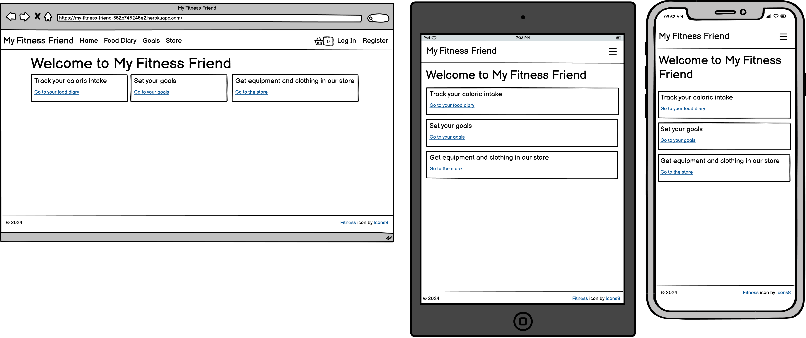

</details>

<details>

<summary>Food Diary</summary>

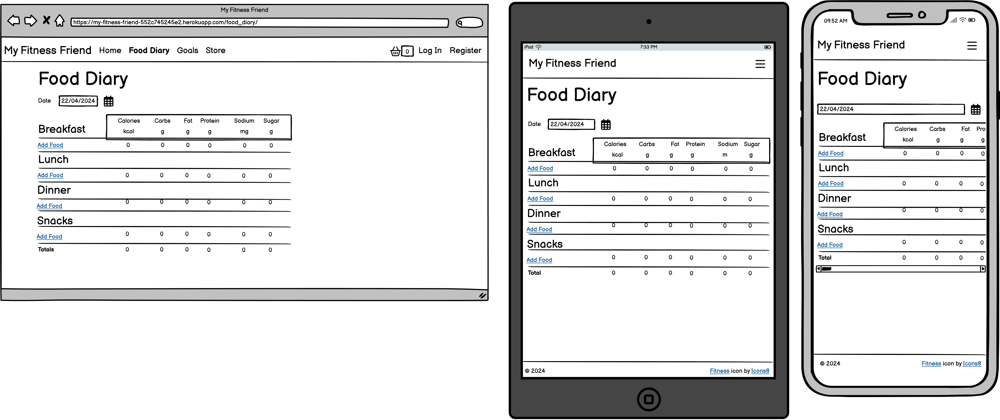

</details>

<details>

<summary>Goals</summary>

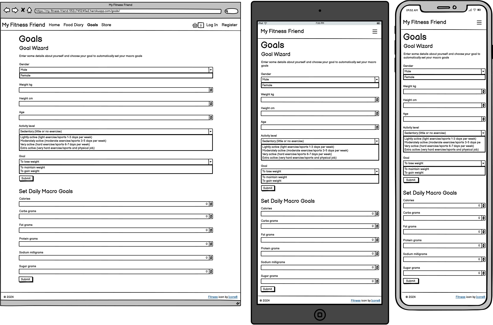

</details>

<details>

<summary>Store</summary>

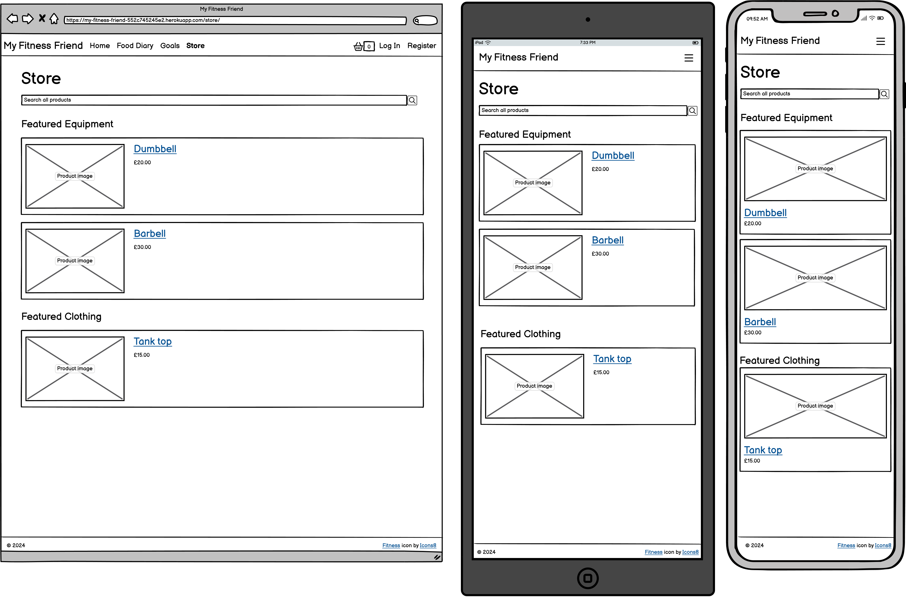

</details>

<details>

<summary>Search Products</summary>

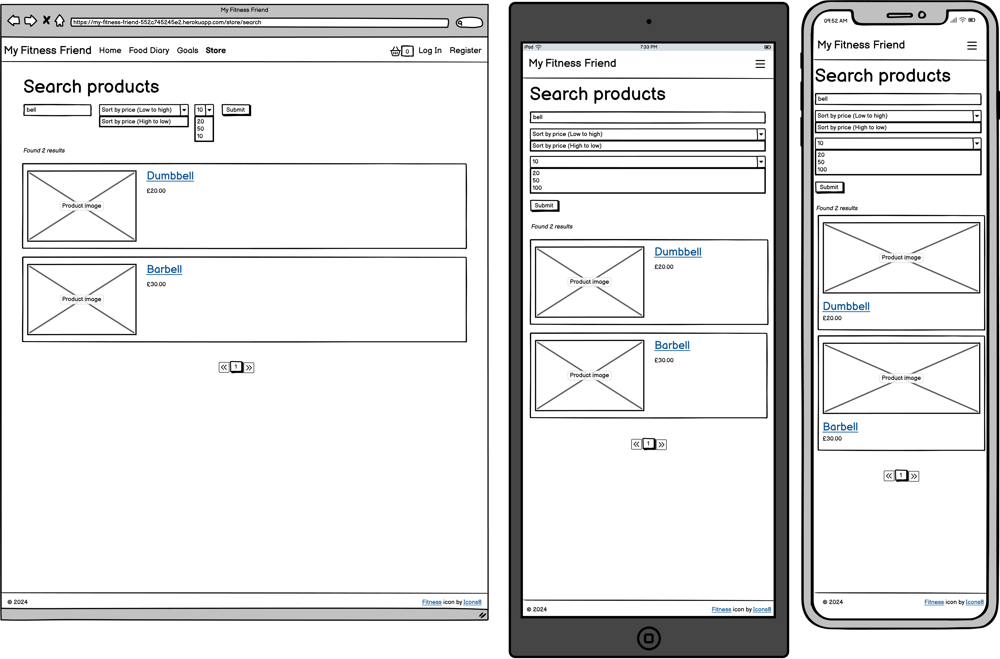

</details>

<details>

<summary>Product Details</summary>

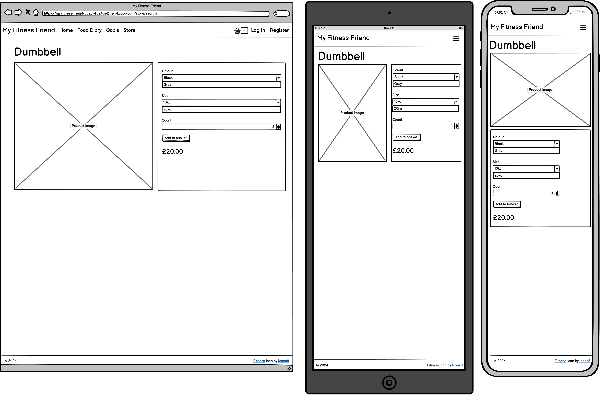

</details>

<details>

<summary>Basket</summary>

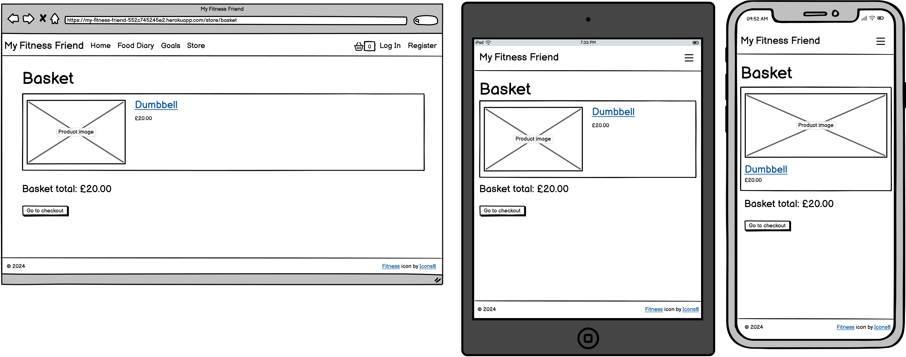

</details>

<details>

<summary>Checkout</summary>

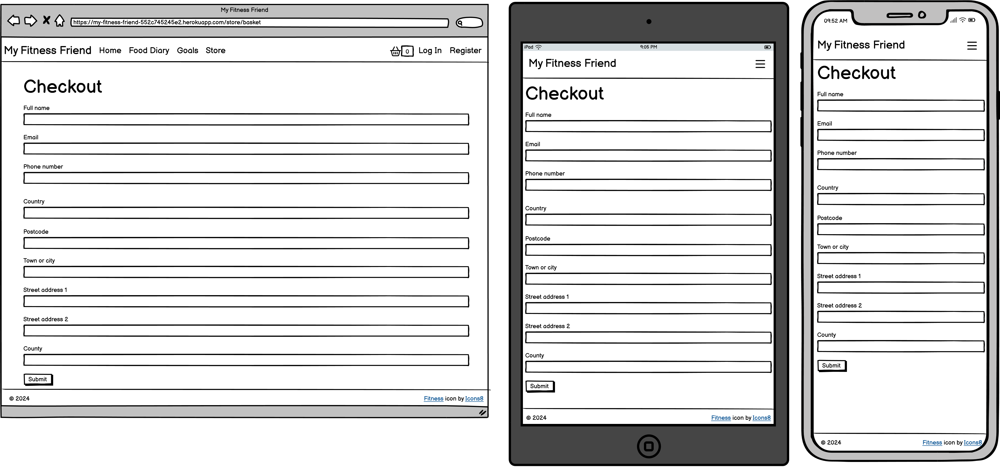

</details>

<details>

<summary>Login</summary>

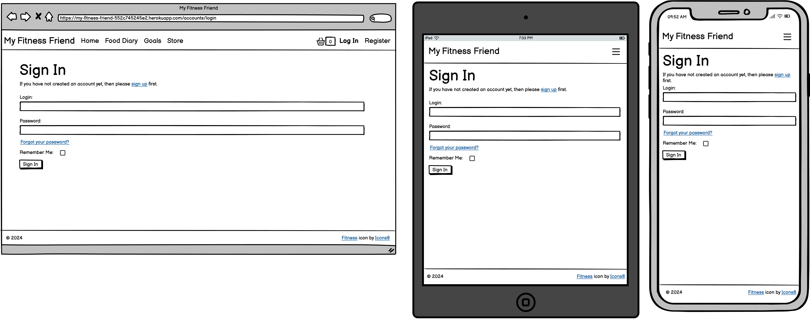

</details>

<details>

<summary>Register</summary>

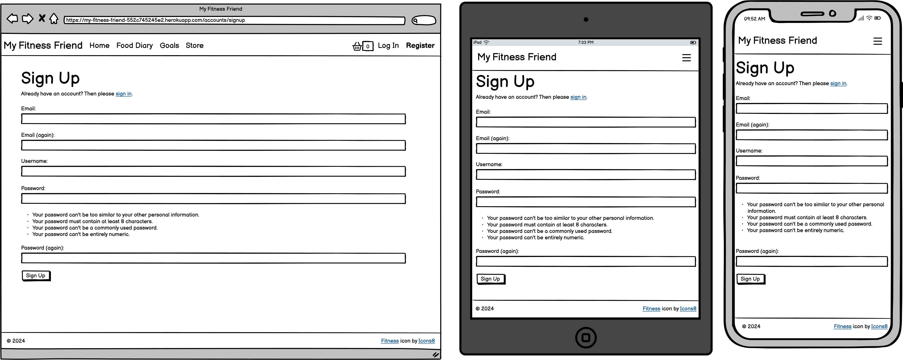

</details>

<details>

<summary>Password Reset</summary>

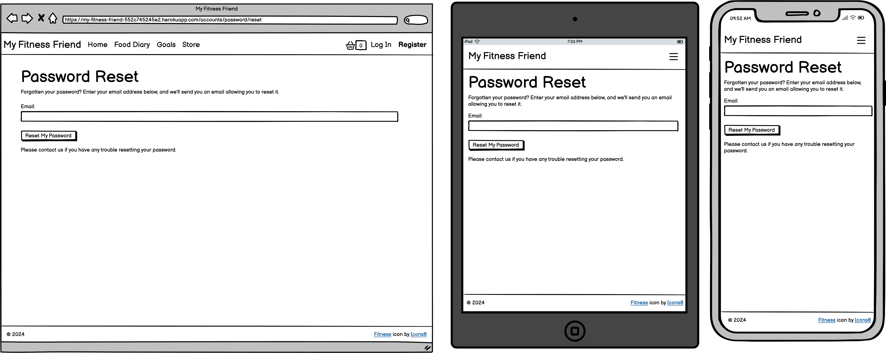

</details>

### Surface

The default Bootstrap scheme will be used in order to deliver a minimum viable product. This can be updated in future iterations.

## Deployment

The website is deployed on Heroku here: <https://my-fitness-friend-552c745245e2.herokuapp.com/>

### Environment variables

| Name                  | Description                   |
| --------------------- | ----------------------------- |
| ENVIRONMENT           | 'Development' or 'Production' |
| SECRET_KEY            | Django secret key             |
| DB_NAME               | Database name                 |
| DB_USER               | Database user name            |
| DB_PASSWORD           | Database user password        |
| DB_HOST               | Database host name            |
| DB_PORT               | Database port number          |
| AWS_ACCESS_KEY_ID     | AWS access key                |
| AWS_SECRET_ACCESS_KEY | AWS secret access key         |
| S3_BUCKET_NAME        | AWS S3 bucket name            |
| STRIPE_PUBLIC_KEY     | Stripe public key             |
| STRIPE_SECRET_KEY     | Stripe secret key             |
| EMAIL_HOST            | SMTP mail host                |
| EMAIL_USER            | SMTP mail user name           |
| EMAIL_PASSWORD        | SMTP mail password            |

## Technologies Used

### Django

[Django](https://www.djangoproject.com/) is "the web framework for perfectionists with deadlines." The Django website framework will be used to facilitate rapid application development (RAD) with templated HTML views, authentication and authorization, form validation, and database object-relational mapping (ORM).

### AWS S3

[AWS S3](https://aws.amazon.com/s3/) is "object storage service offering industry-leading scalability, data availability, security, and performance." It will be used to store static files for the website, and to store media assets such as images for products in the database.

### Elephant SQL

[ElephantSQL](https://www.elephantsql.com/) offers "fully managed and optimized PostgreSQL databases on various cloud platforms and regions." It will be used to host the database that will back the website.

### Stripe

[Stripe](https://stripe.com/) allows the website to "accept payments online, in person, and around the world with a payments solution built for any business – from scaling startups to global enterprises." It will be used to process payments from customers.

## Testing

Testing will be accomplished entirely by a suite of automated tests. This is the output from a run of the test suite:

```console
PS C:\Users\david\source\repos\my_fitness_friend> python manage.py test
Found 62 test(s).
Creating test database for alias 'default'...
System check identified no issues (0 silenced).
..............................................................
----------------------------------------------------------------------
Ran 62 tests in 30.614s

OK
Destroying test database for alias 'default'...
```
